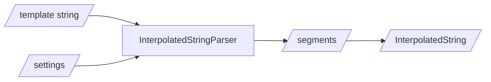
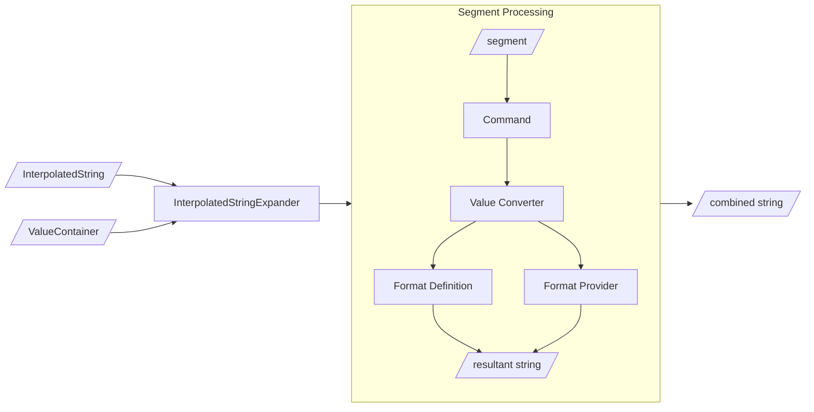

# StringTokenFormatter v9.0

Provides token replacement for interpolated (templated) strings not known at compile time such as those retrieved from data stores (file system, database, API, config files etc) using a variety of token to value mappers.

It isn’t a replacement for string interpolation where the 'interpolation expression' is known at compile time and instead builds upon the idea of `string.Format` where a templated string is passed along with a series of replacement values. This library offers additional features beyond what either of the out-of-the-box implementations provide.

Supported platforms: .NET 5 and later, .NET Standard 2.0

Available on nuget.org at https://www.nuget.org/packages/StringTokenFormatter.

```C#
using StringTokenFormatter;

string interpolatedString = "Hello {FirstName} {LastName}";
var client = new {
    FirstName = "John",
    LastName = "Smith",
};
string message = interpolatedString.FormatFromObject(client);
```

# Migrating to version 9

See [the v8 migration page](/migration-v8.md) for details on breaking changes and how to upgrade from version 8 to version 9.
See [the v6 migration page](/migration-v6.md) for details on breaking changes and how to upgrade from version 6 to version 7.

# Overview

As well as `string` extensions, there are equivalent `Uri` extensions, the preferred method is to use the dependency injection friendly [Resolver](#interpolated-string-resolver) which makes sharing custom settings and working with complex templates easier.

```C#
string templateString = "Answer is {percent,10:P}";
var resolver = new InterpolatedStringResolver(StringTokenFormatterSettings.Default);

string actual = resolver.FromTuples(templateString, ("percent", 1.2));

Assert.Equal("Answer is    120.00%", actual);
```

Tokens with formatting and alignment can be specified in the same way as `string.Format` ([.net docs](https://learn.microsoft.com/en-us/dotnet/api/system.string.format)). Alternative [token syntax](#syntax) can be selected in the [settings](#settings).

Grouping tokens with prefixes, multiple containers and other complex token resolution setups are supported through the `CompositeTokenValueContainer`, see [Building composite containers](#building-composite-token-value-containers) for the helper class.

Conditional blocks of text, loops and simple value mapping can be controlled through [commands](#commands).

As well supporting formatting through `IFormatProvider`, strongly-type `FormatterDefinition`s functions can be configured to match type, token name or format string.

[Value Containers](#value-containers) can return primatives (`string`, `int` etc) as well as `Func` or `Lazy` values which will be resolved before formatting using one of the [Value Converters](#value-converters). Additional converters can be included to perform custom conversion logic after token matching but before formatting.

A more complete example:

```C#
var settings = StringTokenFormatterSettings.Default with
{
    FormatProvider = CultureInfo.GetCultureInfo("en-US"),
    FormatterDefinitions = new[] {
        FormatterDefinition.ForTokenName<int>("Order.Id", (id, _format) =>  $"#{id:000000}"),
        FormatterDefinition.ForType<Guid>((guid, format) => format == "Initial" ? guid.ToString("D").Split('-')[0].ToUpperInvariant() : guid.ToString()),
    },
};
var resolver = new InterpolatedStringResolver(settings);
string templateString = new StringBuilder()
    .AppendLine("Hi {Customer.Name},")
    .AppendLine("Thank you for {:map,Customer.IsFirstOrder:true=your first order,false=your order}.")
    .AppendLine("Order details")
    .AppendLine("- Id: {Order.Id}")
    .AppendLine("- Payment method: {:map,Order.PaymentMethod:DebitCard=Debit card,CreditCard=Credit card}")
    .AppendLine("- Delivery option: {Order.Delivery}")
    .AppendLine("{:if,Order.HasDeliveryComment}- Comment for delivery driver: {Order.DeliveryComment}{:ifend}")
    .AppendLine("Items")
    .Append("{:loop,OrderLines}")
    .AppendLine("- {OrderLines.Product} @ {OrderLines.Price:C}")
    .Append("{:loopend}")
    .AppendLine("Total: {OrderTotal:C}")
    .Append("Ref: {MessageId:Initial}")
    .ToString();
var interpolatedString = resolver.Interpolate(templateString);

var customer = new
{
    Name = "Jane Strong",
    IsFirstOrder = true,
};
var order = new Dictionary<string, object>()
{
    ["Id"] = 8321,
    ["PaymentMethod"] = "CreditCard",
    ["Delivery"] = "Next day",
    ["DeliveryComment"] = "Please leave if no one in",
};
var orderLines = new[]
{
    new OrderLine(product: "T-shirt", price: 25.5),
    new OrderLine(product: "Coat", price: 40.0),
    new OrderLine(product: "Socks", price: 14.0),
};
var combinedContainer = resolver.Builder()
    .AddPrefixedObject("Customer", customer)
    .AddPrefixedKeyValues("Order", order)
    .AddPrefixedSingle("Order", "HasDeliveryComment", order["DeliveryComment"] is not null)
    .AddSequence("OrderLines", orderLines)
    .AddSingle("OrderTotal", orderLines.Sum(x => x.Price))
    .AddSingle("MessageId", new Lazy<object>(() => Guid.Parse("73054fad-ba31-4cc2-a1c1-ac534adc9b45")))
    .CombinedResult();

string actual = resolver.FromContainer(interpolatedString, combinedContainer);

string expected = """
Hi Jane Strong,
Thank you for your first order.
Order details
- Id: #008321
- Payment method: Credit card
- Delivery option: Next day
- Comment for delivery driver: Please leave if no one in
Items
- T-shirt @ $25.50
- Coat @ $40.00
- Socks @ $14.00
Total: $79.50
Ref: 73054FAD
""";

Assert.Equal(expected, actual);

record OrderLine(string product, double price);
```

More [examples](https://github.com/andywilsonuk/StringTokenFormatter/blob/main/StringTokenFormatter.Tests/Examples.cs).

# Interpolated String Resolver

Beyond simple use cases, things can get a little complicated and this is where the `InterpolatedStringResolver` steps in.

Within an application there’s likely to be only one or a small number of defined custom [settings](#settings); these settings are passed into the constructor of the Resolver which then provides methods for converting template strings into resolved strings. The instance of the resolver can be stored in a dependency injection container for ease of use.

- Methods `FromSingle`, `FromPairs`, `FromTuples`, `FromObject`, `FromFunc` and `FromContainer` take in a template `string` or `InterpolatedString` as well as relevant mapping values 
- The `Builder` method creates a new instance of the `TokenValueContainerBuilder` class which is used to construct [complex value containers](#building-composite-token-value-containers)
- Template strings can be converted into `InterpolatedString`s created once and stored ahead of time; the `Interpolate` method parses the template string ready for resolving using token values

The resolver contains the standard token resolving methods and is the preferred mechanism over changing the global settings and using the `string` extension methods.

# How token resolution works

To resolve the tokens within a template string, there is a two stage process, first parsing, then expanding.

## Parsing

The `InterpolatedStringParser` turns a template `string` into an `InterpolatedString` defined as a list of strongly-typed `InterpolatedStringSegment`s.

Generating the `InterpolatedString` can be stored and used multiple times with the `InterpolatedStringExpander`. 



## Expanding

The `InterpolatedStringExpander` take the `InterpolatedString` and processes it using the values in the `ValueContainer`.

1. The passed `ITokenValueContainer` provides the value based on the token name
2. A value conversion is then attempted based on the collection of `TokenValueConverter`s in the settings
3. If the token contains alignment or formatting details, `string.Format` is called with the `FormatProvider` from the settings

Block Commands are processed by the `InterpolatedStringExpander` and follow the flow of steps 2.1 and 2.2 for obtaining their relevant values from tokens. 



# Value Containers

Using properties of an object instance (including an anonymous object) to resolve tokens:
```C#
string templateString = "start {middle} end";
var tokenValues = new { Middle = "center" };
string result = templateString.FormatFromObject(tokenValues);
Assert.Equal("start center end", result);
```

Using a dictionary of values or other implementation of `IEnumerable<KeyValuePair<string, object>>` to resolve tokens:
```C#
string templateString = "start {middle} end";
var tokenValues = new Dictionary<string, object> { { "middle", "center" } };
string result = templateString.FormatFromPairs(tokenValues);
Assert.Equal("start center end", result);
```

Using an enumerable of `ValueTuple`s to resolve tokens:
```C#
string templateString = "start {middle} end";
var tokenValues = new [] { ("middle", "center") };
string result = templateString.FormatFromTuples(source, tokenValues);
Assert.Equal("start center end", result);
```

Using a single name and value to resolve tokens:
```C#
string templateString = "start {middle} end";
string result = templateString.FormatFromSingle("middle", "center");
Assert.Equal("start center end", result);
```

Using a function to resolve tokens:
```C#
string templateString = "start {middle} end";
Func<string, object> func = (token) => { return "center"; };
string result = templateString.FormatFromFunc("middle", func);
Assert.Equal("start center end", result);
```

See [building composite token value containers](#building-composite-token-value-containers) for hierarchical or cascading containers. Also [custom containers](#creating-a-custom-itokenvaluecontainer).

Note: comma (,) and colon (:) should not be used in token names to avoid confusion with alignment and format values.

# Format Definitions

Formatting of token values can be done through the standard `IFormatProvider` interface or by a strongly-typed `FormatterDefinition` function.

Custom `IFormatProvider`/`ICustomFormatter` implementations are an inelegant solution see [.net docs](https://learn.microsoft.com/en-us/dotnet/api/system.icustomformatter); the library provides a mechanism for matching strongly-typed values in addition to other citeria.

Static methods are available on `FormatterDefinition` to create instances that can be passed into the [settings](#settings):

- `ForType<T>(fn)` - Token value matches type `T`
- `ForTokenName<T>(string tokenName, fn)` Token name matches and value matches type `T`
- `ForFormatString<T>(string formatString, fn)` - Format string specific on token segment matches and value matches type `T`
- `ForTokenNameAndFormatString<T>(string tokenName, string formatString, fn)` - Token name, format string and value type `T` all match

Where `fn` is defined as `Func<T, string, string>` with the first parameter being the strongly-typed token value after any [value conversion](#value-converters), the second is the `formatString` or empty if not specified. The return value is the formatted string result.

Token name follows the casing set in `NameComparer` in [settings](#settings) whilst `formatString` is case insensitive. The matching logic is from the most specific to the least irrespective of order.

Example defining two `FormatterDefinition` criteria and format functions:

```C#
static string intFormatter(int value, string _formatString) => value.ToString("D3");
static string nameFormatter(string value, string formatString) =>
{
    if (formatString == "titleCase")
    {
        return $"{value.Substring(0, 1).ToUpper()}{value.Substring(1).ToLower()}";
    }
    return value;
};
var settings = StringTokenFormatterSettings.Default with
{
    FormatterDefinitions = new[] {
        FormatterDefinition.ForType<int>(intFormatter),
        FormatterDefinition.ForTokenName<string>("Name", nameFormatter)
    },
};
var resolver = new InterpolatedStringResolver(settings);

var account = new
{
    Id = 2,
    Name = "Savings Account",
};
string actual = resolver.FromObject("Ref: {Id}, {Name:titleCase}", account);
Assert.Equal("Ref: 002, Savings account", actual);
```

# Commands

To provide additional logic when resolving tokens to values, Commands offer a range of functionality. There are a number of included commands which are enabled by default and custom can be added by implementing the interface `IExpanderCommand`.

Commands included by default which are available in `ExpanderCommandFactory`:

| Command            | Action                                                            |
| :----------------: | :---------------------------------------------------------------: |
| Conditional        | Controls inclusion of containing segments based on boolean value  |
| Loop               | Allows containing segments to be iterated multiple times          | 
| Map                | A comma-separated list of token value to text mappings            | 
| Standard           | Handles tokens and literals not handled by other commands         |

The command names are always lowercase whilst tokens abide by the `TokenResolutionPolicy` (as well as `ValueConverter`s).

## Conditional block command

Simple boolean conditions can be used to exclude blocks of text. 

The starting command format is `:if,token` where `token` resolves to a boolean value dictating whether to include the block. The ending command is `:ifend` and can optionally include the token name.

```C#
string templateString = "start {:if,IsValid}{middle}{:ifend,IsValid} end";
var tokenValues = new { Middle = "center", IsValid = false };
string result = templateString.FormatFromObject(tokenValues);
Assert.Equal("start  end", result);
```

Nested conditions are supported.

## Loop block command

For repeating blocks of content, the loop command offers a number of options.

The syntax for the loop command is `{:loop,token:iterations}` with an ending command of `{:loopend}`. One of `token` or `iterations` must be specified.

Use options:

1. `Token` can be a sequence (see below)
2. `Iterations` is an converted to an `int` sets an upper limit on sequence iterations (to take the first x values)
3. Specifying `Iterations` without `Token` can be used to provide a fixed number of iterations
4. Also `Token` can map to an `int` or equally a `Func` as provided by a [Value Container](#value-containers)

There are also two pseudo tokens defined for loops:

- `::loopiteration` which returns the current iteration starting at 1
- `::loopcount` which is the total number of iterations

Nested loops are supported.

Note: The number of iterations is calculated upon entering the loop and cannot be changed during the iterations.

Also see [the composite builder](#building-composite-token-value-containers) for more on including sequences.

### Token sequence - primatives

The sequence can either be a primative (`string`, `int` etc) or a complex object (see next section).

The `TokenValueContainerBuilder` instance provides methods `AddSequence` and `AddPrefixedSequence` for adding `IEnumerable<object>`; the latter to use `prefix.` before the name.

```C#
string templateString = new StringBuilder()
    .Append("<table>")
    .Append("{:loop,ListValue}<tr>")
    .Append("<td>{::loopiteration:D2}/{::loopcount:D2}</td>")
    .Append("<td>{ListValue}</td>")
    .Append("</tr>{:loopend}")
    .Append("</table>")
    .ToString();
var listValues = new List<string> { "Apple", "Banana", "Cherry", "Damson", "Elderberry" };
var resolver = new InterpolatedStringResolver(StringTokenFormatterSettings.Default);
var combinedContainer = resolver.Builder()
    .AddSequence("ListValue", listValues)
    .CombinedResult();

string actual = resolver.FromContainer(templateString, combinedContainer);

string expected = new StringBuilder()
    .Append("<table>")
    .Append("<tr><td>01/05</td><td>Apple</td></tr>")
    .Append("<tr ><td>02/05</td><td>Banana</td></tr>")
    .Append("<tr><td>03/05</td><td>Cherry</td></tr>")
    .Append("<tr><td>04/05</td><td>Damson</td></tr>")
    .Append("<tr><td>05/05</td><td>Elderberry</td></tr>")
    .Append("</table>")
    .ToString();
Assert.Equal(expected, actual);
```

### Token sequence - objects

The `TokenValueContainerBuilder` instance methods `AddSequence` and `AddPrefixedSequence` will automatically wrap a complex object into an `ObjectTokenValueContainer` and so allows for the same functionality. The object could be a class instance, a record or an anonymous object.

When iterating a complex object, the format is `{:loop,Token.PropertyName}` where `Token` is the sequence name and `PropertyName` is a property on the current sequence iteration object. The `HierarchicalDelimiter` as defined in the [settings](#settings) is used to separate the two components and is period `.` by default.

```C#
var resolver = new InterpolatedStringResolver(StringTokenFormatterSettings.Default);
string templateString = new StringBuilder()
    .Append("{:loop,OrderLines}")
    .AppendLine("- {OrderLines.Product} @ {OrderLines.Price:C}")
    .Append("{:loopend}");
var orderLines = new[]
{
    new OrderLine("T-shirt", 25.5),
    new OrderLine("Coat", 40.0),
    new OrderLine("Socks", 14.0),
};
var combinedContainer = resolver.Builder()
    .AddSequence("OrderLines", orderLines)
    .CombinedResult();

string actual = resolver.FromContainer(templateString, combinedContainer);

string expected = """
- T-shirt @ $25.50
- Coat @ $40.00
- Socks @ $14.00
""";
Assert.Equal(expected, actual);

record OrderLine(string product, double price);
```

### Literal iteration count

For token-derived iterations `{:loop,token}` is used and for constant iterations `{:loop:iterations}` where `iterations` is the number of iterations required. The ending command is `{:loopend}`.

```C#
string templateString = "{:loop,Iterations}{innerValue}{:loopend}";
int callCount = 0;
var called = () => {
    callCount++;
    return callCount switch
    {
        1 => "a",
        2 => "b",                
        _ => "z",
    };
};
var tokenValues = new { Iterations = 2, InnerValue = called };
string result = templateString.FormatFromObject(tokenValues);
Assert.Equal("ab", result);
```

In this example, the token value `InnerValue` is a `Func<string>` which returns a different value on each call to the function.

## Map command

The map command allows for simple key/value mapping; the idea being to keep the text inside the template rather than in code.

An example where `Mode` is the token name and after the colon `:` are the comma-separated key/value mappings:

```C#
{:map,Mode:Bike=Self propelled,Car=Combustion engine,Bus=Electric,_=Not set}
```

The key is the `string` output of resolving the token’s value and performing any conversion in the usual way. Common token values are `enum`, `string` and `int` where there is a small number of discrete mappings.

The last parameter can optionally be a catch-all by using the discard operator `_` as shown in the example.

## Standard command

The default command used when not segment is not handled previously. It expands simple token and literal segments.

When modifying the Command settings, the Standard Command should be included to provide the basic functionality.

## Custom commands

Implementing command is done using the interface `IExpanderCommand` which is then included in the [settings](#settings).

Three methods are available:

- `Init` which happens at the start of the expansion process
- `Evaluate` is called for each segment, unless it has been handled by setting `context.SegmentHandled` to true
- `Finished` can be used for validation such as the number of end commands match the start commands

For pseudo command and additional interface `IExpanderPseudoCommands` can be implemented which works in the same way as for [value containers](#value-containers).

Commands in this form were introduced in version 9 and therefore are considered beta and might be subject to interface changes are more use cases are identified.

# Building composite token value containers

The `TokenValueContainerBuilder` provides methods for creating `CompositeTokenValueContainer` instances.

Note that matching attempts are made in the order that the containers are passed to the `CompositeTokenValueContainer` instance which will be the same as the order that they are added to the builder. This includes prefixed containers.

Child containers are supported such that `{prefix.token}` first matches the prefix and then uses the associated container to match the suffix. In the example below, the prefix is `Account` and the suffix `Id` exists as a property on the `account` object.

```C#
var account = new {
    Id = 2,
    Name = "The second account",
};

var combinedContainer = new TokenValueContainerBuilder(StringTokenFormatterSettings.Default)
    .AddSingle("text", "Message text")
    .AddPrefixedObject("Account", account)
    .CombinedResult();

string templateString = "Ref: {Account.Id}. {text}.";
string actual = templateString.FormatFromContainer(combinedContainer);

Assert.Equal("Ref: 2. Message text.", actual);
```

The delimiter can be changed in the [settings](#settings).

Deep nesting is supported but discouraged, instead opt for flatter composites by adding the child container to the top level with a separate prefix.

# Settings

All interpolating methods accept an optional `StringTokenFormatterSetting`s parameter which is used in preference to the `StringTokenFormatterSettings.Global` settings.

The settings class is immutable so the `with` keyword is used to mutate the settings.

Using the `Global` settings as the base:

```C#
var customSettings = StringTokenFormatterSettings.Global with { Syntax = CommonTokenSyntax.Round };
var expanded = "This interpolated string uses (token) as its syntax".FormatFromSingle("token", "expanded value", customSettings);
```

Using the default settings as the base:

```C#
var settings1 = new StringTokenFormatterSettings { Syntax = CommonTokenSyntax.Round };
// or
var settings2 = StringTokenFormatterSettings.Default with { Syntax = CommonTokenSyntax.Round };
```

Initially, the `Global` settings are the `Default` settings.

## Overriding the global settings

```C#
StringTokenFormatterSettings.Global = StringTokenFormatterSettings.Global with { Syntax = CommonTokenSyntax.Round };
```

It should be noted that whilst overriding the global is a convenient action, it can cause side effects by other code using this library. Library implementations should not update `Global`. Alternately, consider creating an instance of `InterpolatedStringResolver` which takes the settings object in its constructor and provides the common methods for expanding from different `ITokenValueContainer` implementations.

## Settings properties

### `Syntax`

Takes a `TokenSyntax` instance and defines the syntax is used for detecting tokens. Default `CommonTokenSyntax.Curly`.

Build-in syntax within the CommonTokenSyntax class:

| Name                   | Marker       | Escape |
| :--------------------: | :----------: | :----: |
| Curly                  | `{Token}`    | `{{`   |
| DollarCurly            | `${Token}`   | `${{`  |
| Round                  | `(Token)`    | `((`   |
| DollarRound            | `$(Token)`   | `$((`  |
| DollarRoundAlternative | `$(Token)`   | `$$(`  |

Note: Token markers are case sensitive.

### `FormatProvider`

Used to specify the `IFormatProvider` applied to token values. Default `CultureInfo.CurrentUICulture`.

Specific cultures info - in this instance `en-US` - can be used as with `string.Format`.

```C#
var settings = StringTokenFormatterSettings.Default with
{
    FormatProvider = CultureInfo.GetCultureInfo("en-US"),
};
```

### `FormatterDefinitions`

Contains a collection of strong-typed custom formatters. Default is empty collection.

```C#
var settings = StringTokenFormatterSettings.Default with
{
    FormatterDefinitions = new[] {
        FormatterDefinition.ForTokenName<int>("Id", (id, _format) =>  $"#{id:000000}"),
        FormatterDefinition.ForType<Guid>((guid, format) => format == "InitialOnly" ? guid.ToString("D").Split('-')[0].ToUpper() : guid.ToString()),
    },
};
```

For more information see the [format definitions](#format-definitions) section.

### `NameComparer`

The comparer used by `ITokenValueContainer` when performing token to value look-ups. Takes a standard `StringComparer`. Default `StringComparer.OrdinalIgnoreCase`.

### `Commands`

The collection of `IExpanderCommand` implementations to be used by the `InterpolatedStringExpander`. Default collection from `ExpanderCommandFactory`: `Conditional`, `Loop`, `Map`, `Standard`.

See [Commands](#commands) for more information.

### `TokenResolutionPolicy`

Controls how token values are handled by `CompositeTokenValueContainer` implementations. Default `TokenResolutionPolicy.ResolveAll`.

The policies are:

| Policy            | Result                                                   |
| :---------------: | :------------------------------------------------------: |
| ResolveAll        | Always uses the value returned                           |
| IgnoreNull        | Uses the value if it is not null                         |
| IgnoreNullOrEmpty | Uses the value if it is not null and not an empty string |

### `UnresolvedTokenBehavior`

Defines what should happen if the token specified in the interpolated string cannot be matched within the `ITokenValueContainer`. Default `UnresolvedTokenBehavior.Throw`.

| Behavior          | Result                                                   |
| :---------------: | :------------------------------------------------------: |
| Throw             | An `UnresolvedTokenException` exception is raised        |
| LeaveUnresolved   | The text will contain the templateString token unmodified      |

### `InvalidFormatBehavior`

Defines how `string.Format` or `FormatDefinition` exceptions are handled. Default `InvalidFormatBehavior.Throw`.

| Behavior          | Result                                                     |
| :---------------: | :--------------------------------------------------------: |
| Throw             | An `TokenValueFormatException` exception is raised         |
| LeaveUnformatted  | The text will contain the token value unformatted          |
| LeaveToken        | The text will contain the templateString token unmodified  |

### `ValueConverters`

Applies to token values after matching but before formatting. Converters are attempted in order so that once one has successfully converted the value then no further conversions take place. 

By design `ToString` is not used as a value converter because calling that on a custom object will yield the `object.ToString` result which is often not the intended behavior.

For more information see the [Value Converters](#value-converters) section.

### `HierarchicalDelimiter`

Defines the prefix for `HierarchicalTokenValueContainer` instances. Default `.` (period).

See also [Token Value Container Builder](#building-composite-token-value-containers).

# Exceptions

`TokenContainerException` - thrown when data passed to container constructor is invalid

`ParserException` - general problem parsing the template string into an `InterpolatedString`

`ExpanderException` - general problem expanding the `InterpolatedString` into the resultant string 

`UnresolvedTokenException` - the token cannot be found in the container

`MissingValueConverterException` - the token value does not match any of the [value converters](#value-converters)

`TokenValueFormatException` - the token value failed to format

The base exception from which these inherit is `StringTokenFormatterException`.

# Creating a custom `ITokenValueContainer`

Whilst there are a number of built-in containers, it may be necessary to create a completely custom container. The container should take in the settings interface `ITokenValueContainerSettings` and obey the `NameComparer` property.

See also [Token Value Container Builder](#building-composite-token-value-containers).

# Performance tuning

- Parse a template string into an `InterpolatedString`, most easily done using the [Resolver](#interpolated-string-resolver)
- Remove unused commands from the [settings](#settings)
- Remove unused Value Converters from the [settings](#settings)
- Reuse [Value Containers](#value-containers) where possible
- Use .NET 6 or above for improved regex performance
- Use .NET 8 FrozenDictionary for faster read access, see the [Frozen Dictionary section](#frozen-dictionary-support-in-net-8-support-in-net-8)

# Value Converters

Applies to token values after matching but before formatting. Converters are attempted in order so that once one has successfully converted the value then no further conversions take place. Default collection (from `TokenValueConverterFactory`):

| Value                       | Result                                                   |
| :-------------------------: | :------------------------------------------------------: |
| Null                        | no conversion                                            |
| `string` or `ValueType`     | no conversion                                            | 
| `Lazy<T>`                   | `Lazy.Value`                                             |
| `Func<T>`                   | function result                                          |
| `Func<string, T>`           | Supplied token name function result                      |

They can be useful to provide post-token match functionality; a great example is a when using an object which contains a property that uses a `Lazy`. The token matcher resolves the token marker to property and then through the `ValueConverters` calls the `Lazy.Value` and returns the value of the `Lazy` for formatting.

All token value types must be handled by a Value Converter otherwise an exception is thrown.

By design `ToString` is not used as a value converter because calling that on a custom object will yield the `object.ToString` result which is often not the intended behavior. For scenarios when the `ToString` has been overridden, the result of calling `StringTokenFormatter.Impl.TokenValueConverterFactory.ToStringConverter<T>()` can be added to the settings list of `ValueConverters` so that the `ToString` method for that specific type will be used as a valid value conversion.

# Thread safety

By default, the library is designed to be broadly stateless, deterministic and thread-safe.

Instances of [settings](#settings) and parsed `InterpolatedString`s can be reused on the same or another thread. The included [Value Containers](#value-containers) maintain the value mappings which largely will resolve to primative values (`string`, `int` etc) however using `Func` or `Lazy` values could lead to stateful behavior and should be avoided.

It should be noted that [expanding](#how-token-resolution-works) tokens to values, internally creates context state and is subject to garbage collection; at this time, there is no pool for reusing spent context state.

# Frozen Dictionary support in .NET 8

When compiling against the .NET 8 version of the library, a method `Frozen` is available on `DictionaryTokenValueContainer` and `ObjectTokenValueContainer` instances which sets the backing dictionary and can provide a significant performance boost when reusing instances.

# Async loading of token values

There is no plan to support async/await within the library; the reason is that the library is designed to the CPU-bound and adding in an IO-bound layer massively changes the design and considered use-cases.

The `InterpolatedString` returned by the `InterpolatedStringParser` contains an extension method `Tokens` which provides a unique list of tokens found within the interpolated string. These token names can be used by an async method to, for example, request the token values from a data store. The token values can be loaded into an object or `IEnumerable<KeyValuePair<string, T>>` and provided as a parameter to the matching `TokenValueContainerFactory` method. The `InterpolatedString` and `ITokenValueContainer` can then be passed to the `InterpolatedStringExpander.Expand` method which in turns returns the resultant string.
